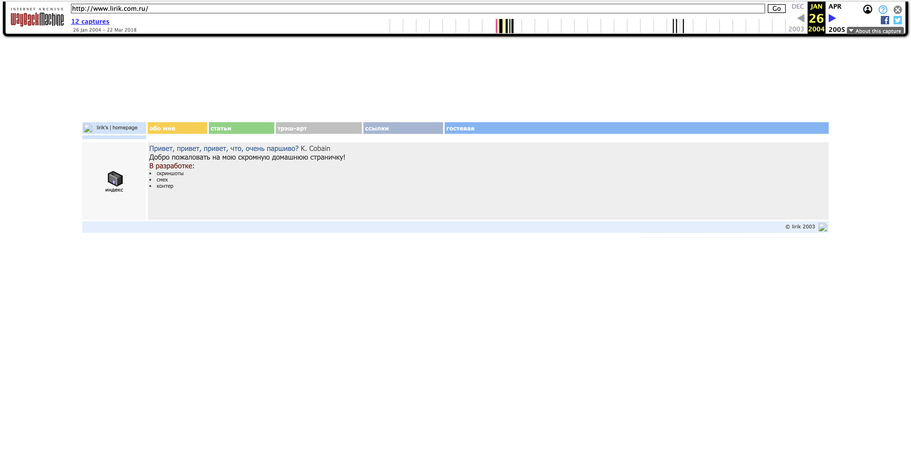

In 2003 I built my first website. It was extremely simple, laid out entirely with tables and floats — and it even had a guestbook!

<a href="https://web.archive.org/web/20040126122535/http://www.lirik.com.ru/" target="_blank" rel="noopener noreferer">
  Here is what it looked like
</a>

Not bad for 2003 :) I’m still amazed the web archive saved it!

