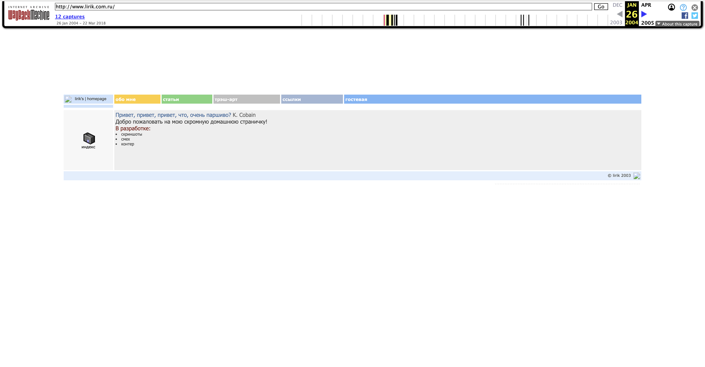

В 2003 году я создал свой первый сайт. Он был очень простым, сверстан исключительно на таблицах и флоатах. А еще там была Гостевая книга!

<a href="https://web.archive.org/web/20040126122535/http://www.lirik.com.ru/" target="_blank" rel="noopener noreferer">
  Вот как он выглядел
</a>

Вполне сносно для 2003 года :) Удивительно, что web archive его сохранил!
