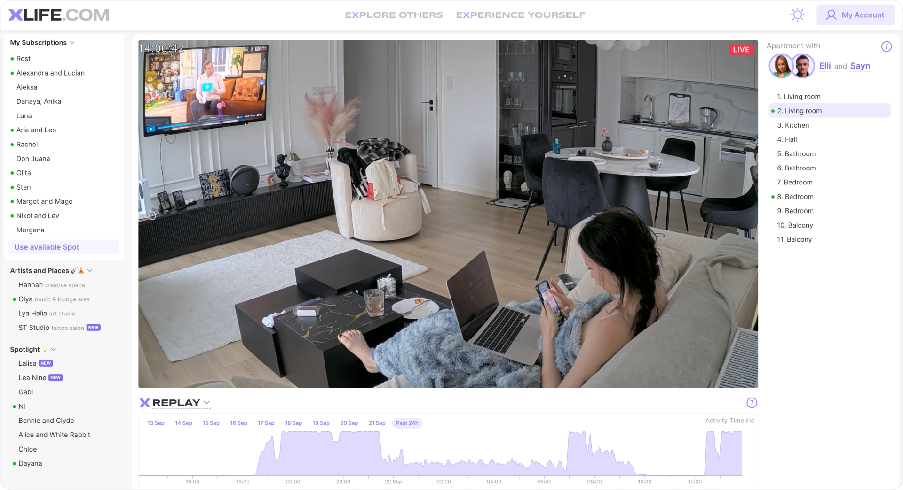

## About the project

Xlife.com is a livestreaming platform where people share real, unedited life. The service connects users from different countries and cultures, letting you follow their everyday routines, hobbies, and personal growth.

## Objective

Design the entire interface of the streaming platform from scratch.

Build an intuitive payment flow, assemble a scalable design system, and lay the groundwork for flexible theming.

### What I delivered

- Ran the full UX/UI process, from research to launch
- Created the brand identity
- Built prototypes and described user scenarios
- Designed the payment page and token purchase flow
- Assembled a UI kit (Figma → SCSS styles + React components)
- Implemented the initial frontend
- Set up theming

> Design and development ran in parallel: I tested static interfaces right away as Storybook components.

## Application interface

### Landing page

Visitors immediately dive into real people’s lives. The layout keeps navigation one click away, while the center of the screen is devoted to the most popular stream.

### Checkout

Purchases revolve around subscription bundles: users compare plans, see benefits, and understand limitations. A Q&A block answers common questions.

Fewer steps mean less doubt. I removed everything that might distract from making a decision.

### Donations

I designed the coin-based donation system and a modal where fans can thank their favourite streamer and leave a short message.

### My subscriptions

Subscribers get a dedicated page to manage their favourite streamers.

### Streamer catalog

The catalog helps you explore profiles, browse images, and follow interesting people in one click.

### Design system and theming

I assembled a UI kit with tokens, typography, and components. Figma components are linked to SCSS variables and React, which simplifies maintenance. Theming is handled with CSS variables.

## Results

- A production-ready, scalable web product
- A transparent payment flow
- A flexible design system that both designers and developers can build on
- Dark/light themes baked into the foundation

