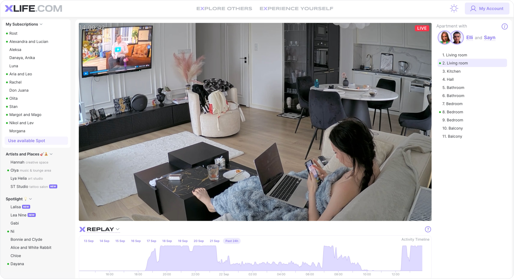
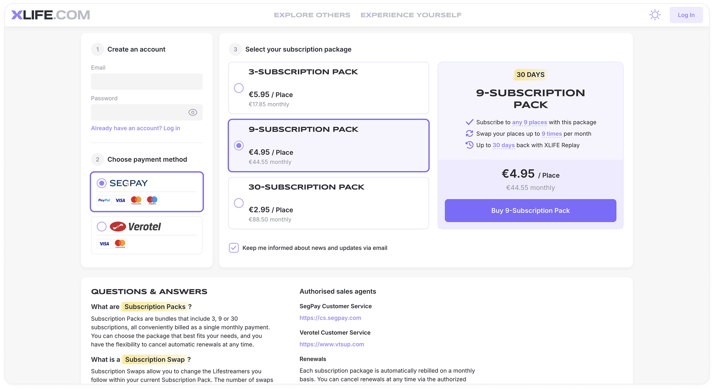
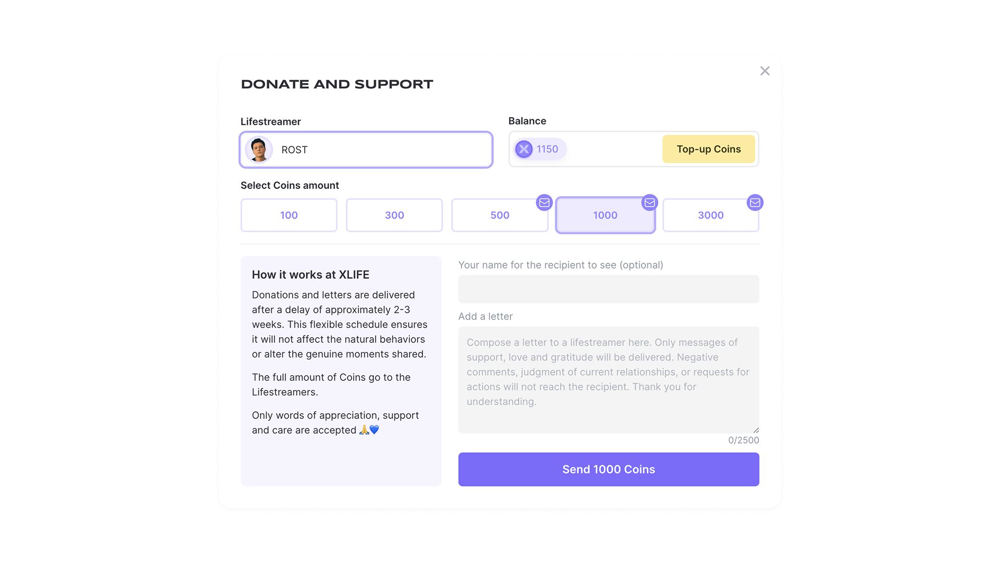
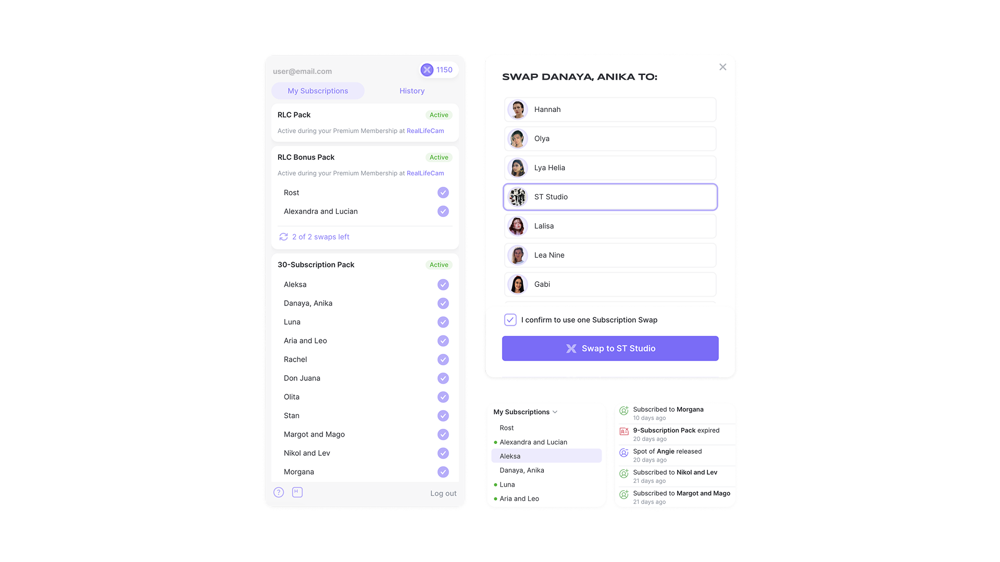
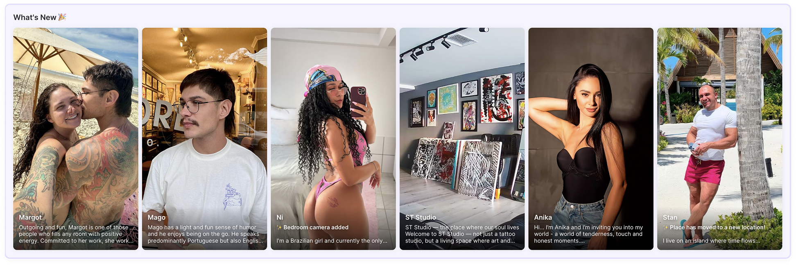
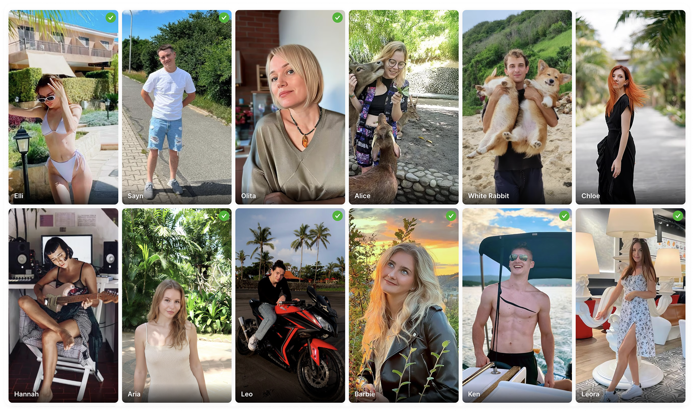

## О проекте

Xlife.com — это лайф-стриминг платформа, где люди делятся реальной неотредактированной жизнью. Сервис объединяет пользователей из разных стран и культур, позволяя наблюдать их повседневную жизнь, хобби и путь личного роста.

## Задача

С нуля создать интерфейс платформы видеостриминга.

Разработать понятный и простой платёжный сценарий, собрать масштабируемую дизайн‑систему и заложить гибкую темизацию.

### Что я сделал

- Провёл полный UX/UI‑процесс, от исследований до запуска
- Разработал айдентику бренда
- Создал прототипы и описал пользовательские сценарии
- Спроектировал платёжные страницу и покупку токенов
- Разработал UI-кит (Figma → SCSS‑стили + React‑компоненты)
- Реализовал базовый фронтенд
- Настроил систему темизации

> Дизайн и разработка шли параллельно: я сразу тестировал статичные интерфейсы в виде компонентов в StoryBook.

## Интерфейс приложения

### Главный экран

Попадая на сайт, пользователь сразу погружается в просмотр жизни реальных людей. Интерфейс спроектирован так, чтобы навигация была доступна в один клик. А по центру экрана — плеер со трансляцией популярной камеры.

### Страница оплаты

Покупка строится вокруг «пакетов» подписок: пользователь выбирает пакет, видит его преимущества и ограничения. На возможные вопросы отвечает блок Q&A.

Чем короче шаги при оплате — тем меньше сомнений. Я убрал всё, что мешает принять решение.

### Донаты

Я спроектировал систему донатов (Coins) и модальное окно, где каждый пользователь может поблагодарить любимого стримера и отправить короткое сообщение.

### Мои подписки

У пользователя есть раздел «Мои подписки», где удобно видеть список своих стримеров.

### Каталог стримеров

Позволяет изучать профили участников, смотреть фото и подписываться на интересных людей в один клик.

### Дизайн‑система и темизация

Я собрал UI-кит с токенами, типографикой и компонентами. Компоненты из Figma связаны с SCSS‑переменными и React, что облегчает поддержку. Темизация реализована через переменные.

## Результаты

- Готовое к масштабированию веб‑приложение
- Прозрачный платёжный сценарий
- Гибкая дизайн-система, с которой удобно работать и дизайнерам, и разработчикам
- Темизация
