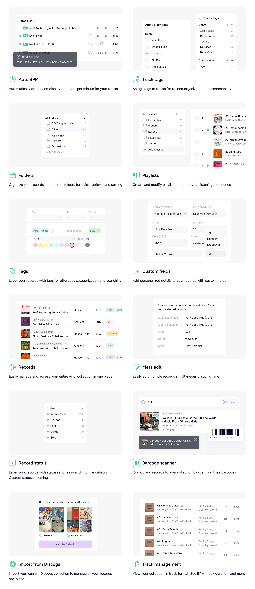

## About the project

Vinyls.Pro is a platform that helps vinyl enthusiasts and DJs manage their collections.

### My contributions

- Mapped user scenarios and flows
- Crafted the branding and visual language (together with a graphic designer)
- Built a UI kit and design system with light and dark themes
- Designed the product interface
- Developed the marketing site with an interactive feature overview
- Adapted the interface for mobile devices
- Joined the frontend development on React and Next.js

## Interface

### Home

Structured as a dashboard with key stats and summaries about the collection.

### Interactive widgets

Every key widget on the Home page is interactive. The timeline shows how the collection grows. The stats widget highlights records and builds charts automatically. An interactive map shows where each record was purchased.

### Collection mode

Collection mode is a table view for power users: categorisation, filters, tags, statuses, notes, and more.

### Mobile version

The interface is fully adapted for mobile devices.

### UI kit and design system

A unified design system with components, tokens, typography, and states.

### Landing page

The landing page was built with Next.js and a custom design system. It includes an interactive product tour, highlights the service, and explains the pricing plans.

## Result

The outcome is a cohesive, intuitive, and powerful interface for managing a vinyl collection.

The product keeps evolving and is currently in the MVP stage. Upcoming plans include public discographies and sharing collections with friends.

