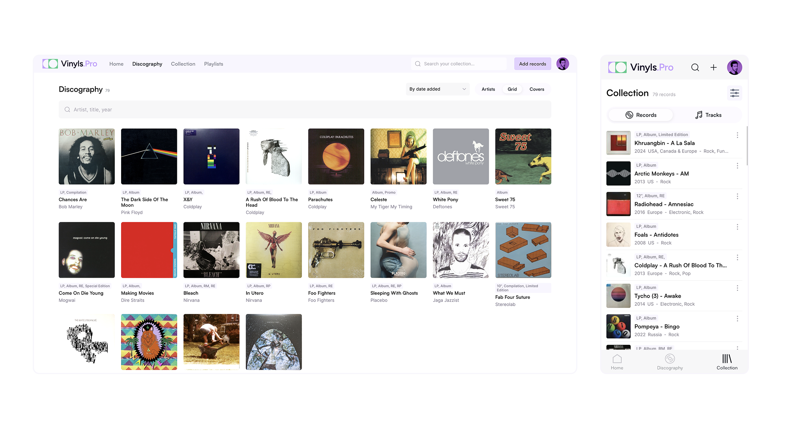
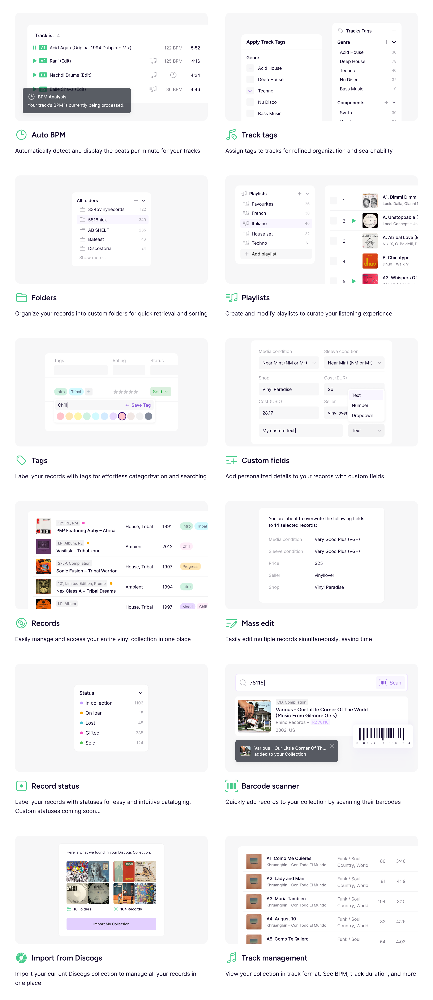
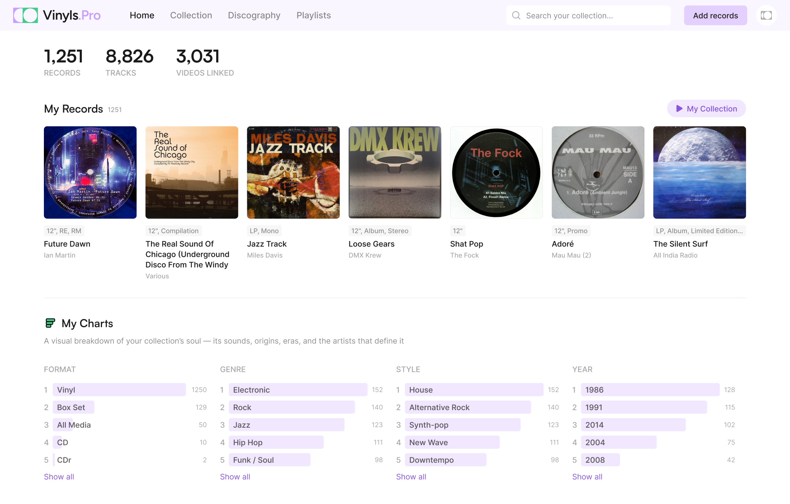
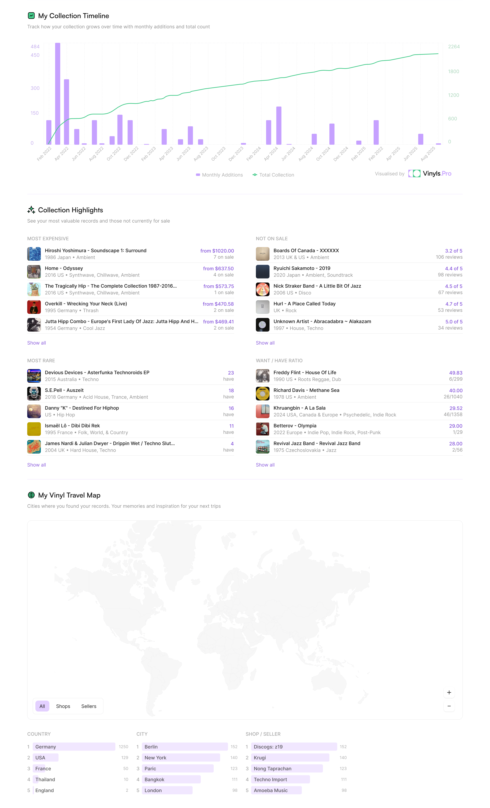
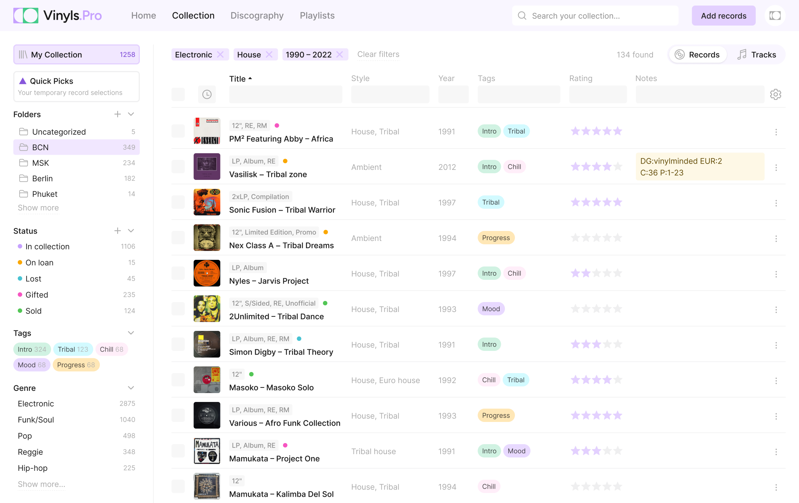
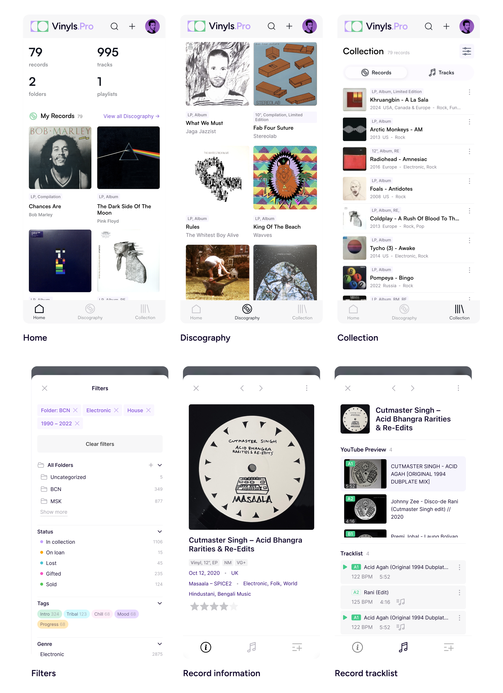

## О проекте

Vinyls.Pro — это современная платформа для управления виниловыми коллекциями, созданная для ценителей пластинок и диджеев.

### Что я сделал

- Cпроектировал интерфейс сервиса
- Проработал пользовательские сценарии и юзер-флоу
- Создал брендинг и визуальный стиль (в связке с графическим дизайнером)
- Разработал лендинг с интерактивной презентацией возможностей
- Создал UI-кит и дизайн-систему, внедрил тёмную и светлую темы
- Адаптировал интерфейс для мобильных устройств
- Участвовал во фронтенд-разработке на React и Next.js

## Интерфейс и возможности

В Vinyls.Pro я хотел изменить подход к взаимодействию диджеев и коллекционеров с их виниловыми коллекциями, разработав для этого набор продуманных инструментов.

### Страница Home

Оформлена в виде дашборда. Здесь собрана основная информация и статистика по коллекции.

### Интерактивные виджеты

Все ключевые элементы страницы Home интерактивны. На временной шкале удобно видеть, как росла моя коллекция. Виджет с ключевыми данными даёт полезную информацию о пластинках и автоматически строит чарты. Интерактивная карта показывает, в каких городах и странах были куплены пластинки.

### Режим Коллекции

Режим Коллекции — табличный вид для продвинутых пользователей: категоризация, фильтрация, теги, статусы, заметки и многое другое.

### Мобильная версия

Интерфейс адаптирован для мобильных устройств.

### UI-кит и дизайн-система

Создана единая дизайн-система с набором компонентов, токенов, типографики и состояний. Это обеспечивает визуальное единообразие и ускоряет развитие продукта.

### Лендинг

Лендинг был разработан с использованием Next.js и кастомной системой стилей. Он содержит интерактивную презентацию возможностей сервиса, информацию о нём и блок с тарифами.

## Результат

Получился цельный, интуитивно понятный и в то же время мощный интерфейс для управления виниловой коллекцией.

Проект активно развивается и сейчас находится в стадии MVP. В ближайшее время планируется добавить больше функций: например, публичную дискографию и возможность делиться своей коллекцией.
