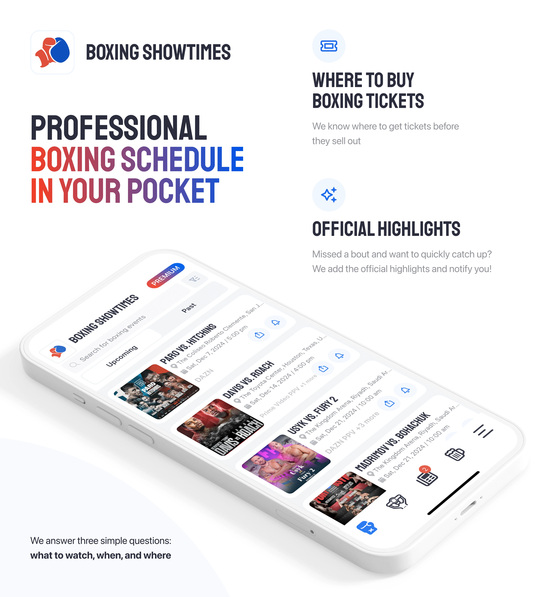
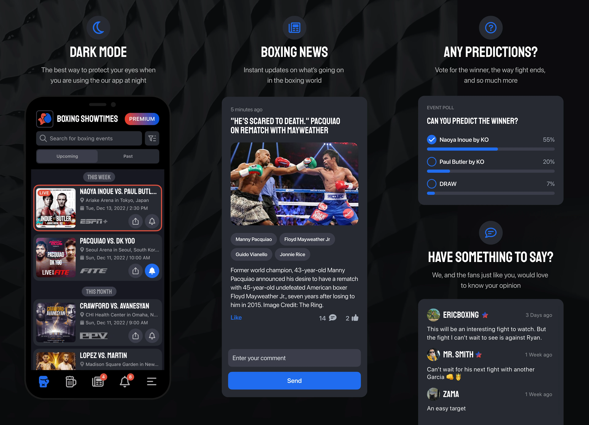
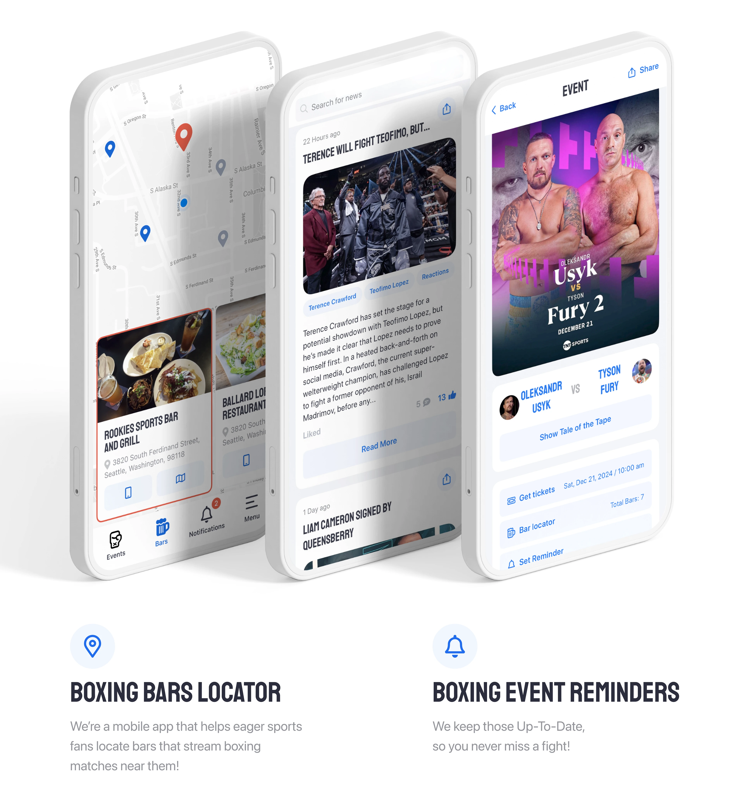
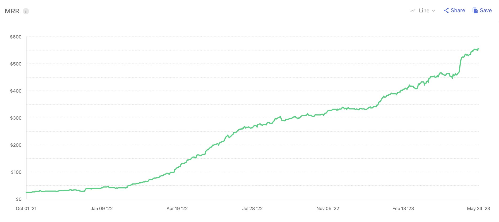

## Запрос

Знакомые ребята из <a href="https://itprobe.us" target="_blank" rel="noopener">itprobe</a> (Сиэттл, США) обратились ко мне с просьбой сделать полный редизайн текущего приложения. Оно требовало полного переосмысления UX и UI.

## Что я сделал

- Проработал все пользовательские сценарии и юзер‑флоу
- Разработал дизайн‑систему с токенами и компонентами
- Отрисовал все экраны приложения, учитывая особенности iOS HUD
- Реализовал темизацию

## Результаты

- Значительный рост скачиваний и оплат после обновления дизайна
- К ребятам обратилось топовое агентство по B2B-маркетингу — <a href="https://toprank.com" target="_blank" rel="noopener">TopRank</a> — для долгосрочного сотрудничества
