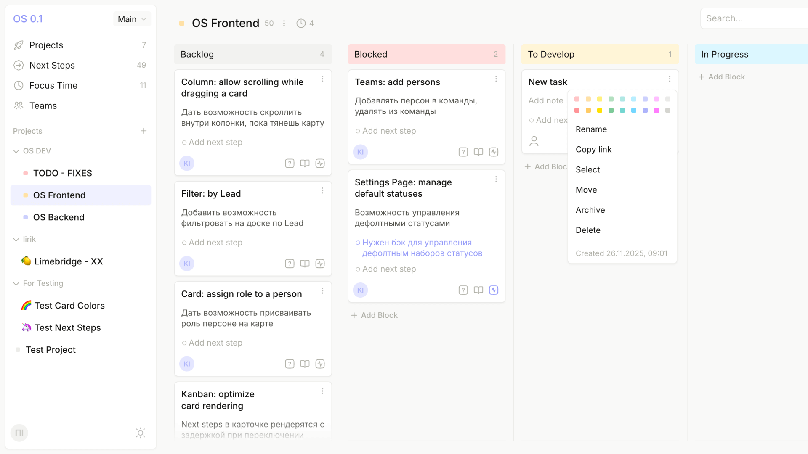
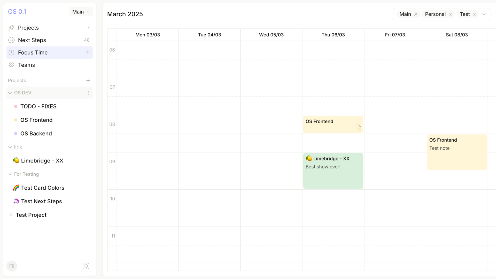
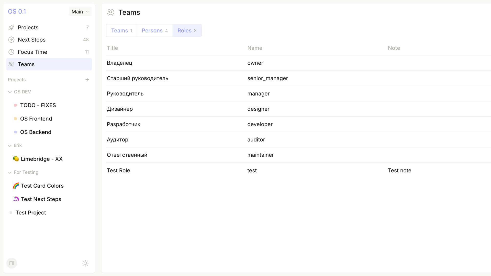
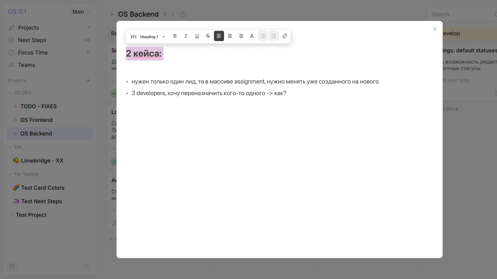
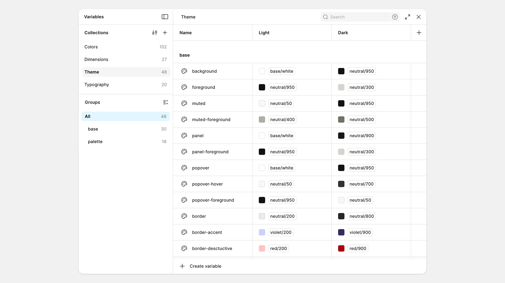
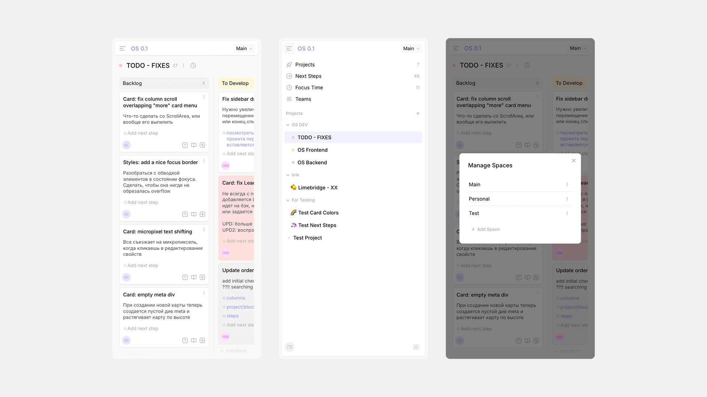

## About the project

OS is a web application for project and task management featuring a kanban board, calendar, and team system. Built with React and a custom design system based on radix-ui.

### My contributions

- Designed the interface and application layout from scratch
- Developed a design system and UI kit
- Prepared Figma mockups with design tokens ready for React integration
- Built a custom design system based on radix-ui components
- Implemented components and interfaces with frontend logic
- Added drag-and-drop functionality for kanban boards
- Designed a team and role management system
- Developed a weekly calendar for time planning
- Created responsive design for mobile devices
- Collaborated closely with the product owner, frontend and backend developers, and DevOps

## Kanban board

The main interface is a kanban board with projects. Status columns (Backlog, Ready to go, Blocked, Active) provide a visual way to track progress.

## Theming

The application supports light and dark themes. Switching is instant thanks to CSS variables and design tokens.

## Calendar

The Focus Time section displays tasks and events in a weekly calendar. Convenient for planning time and seeing workload by day.

## Team management

The Teams section allows managing teams, members, and roles. A tabular interface with Teams, Persons, and Roles tabs.

## Rich-text notes editor

A built-in rich-text editor for descriptions and notes. Supports formatting, lists, and text highlighting. Powered by BlockNote library.

## Tokenisation

A design token system was developed in Figma Variables: colours, dimensions, themes, and typography. Tokens are synced with the codebase.

## Mobile adaptation

The interface is adapted for mobile devices. The sidebar collapses into a burger menu, and the kanban board becomes horizontally scrollable.

## Results

- Fully designed and implemented application interface
- Complete design system with tokens synced between Figma and code
- Reusable components based on radix-ui
- Light and dark theme support
- Responsive layout for desktop and mobile devices

