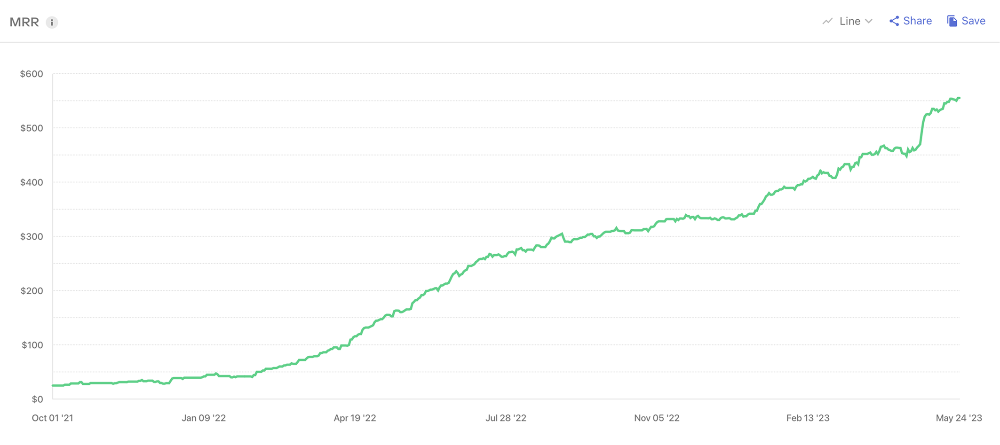

## Brief

Friends from <a href="https://itprobe.us" target="_blank" rel="noopener">itprobe</a> (Seattle, USA) asked me to redesign their existing app from the ground up. The product needed a complete UX and UI rethink.

## My contributions

- Reworked every user scenario and flow
- Built a design system with tokens and components
- Designed all app screens while respecting iOS specifics (HUD)
- Added theming support

## Outcomes

- A substantial increase in downloads and purchases after the redesign
- Interest from the leading B2B marketing agency <a href="https://toprank.com" target="_blank" rel="noopener">TopRank</a> for a long-term collaboration

