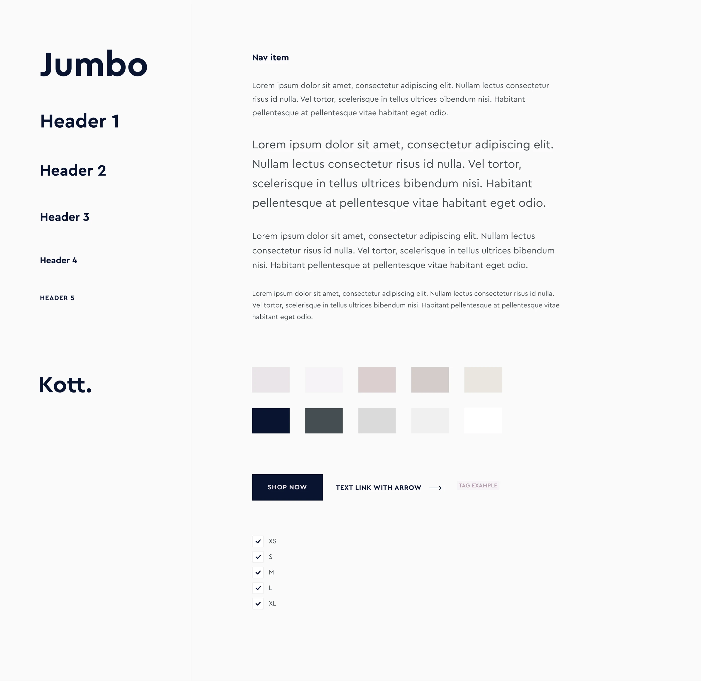
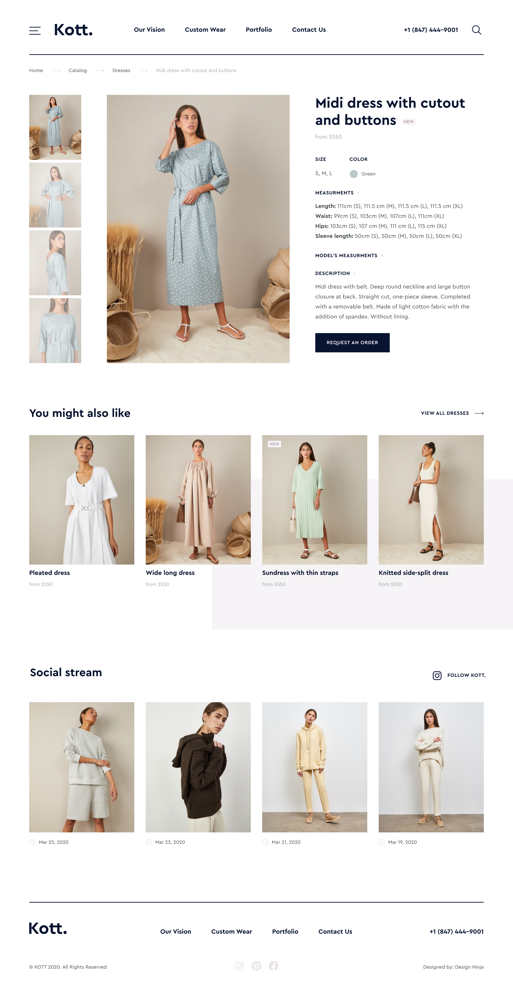
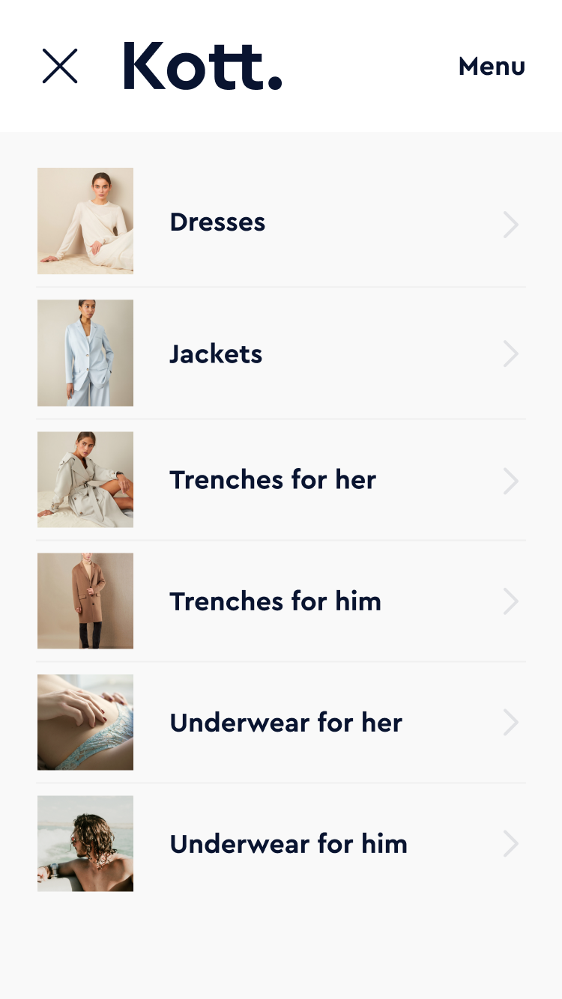

## Задача

Мария попросила создать современный и выразительный бренд для её магазина кастомной одежды. Следующим шагом стал минималистичный сайт на Shopify для продвижения и продажи изделий.

### Что я сделал

- Разработка логотипа и типографической системы
- Презентация бренда на носителях (визитки)
- Подбор стиля и подготовка компактного гайда
- Создание сайта Shopify: главная, каталог, категории, карточка товара
- Адаптация под мобильные устройства

## Брендинг

### Поиск логотипа и типографики

Пробовал разные направления в типографике и графике, чтобы закрепить характер бренда.

### Презентация бренда

Собрал наглядные мокапы, чтобы показать, как айдентика работает на носителях.

## Веб‑сайт Shopify

### Исследование и настройка стилистики

Изучил разные визуальные подходы, чтобы поймать вдохновение и собрать собственный вайб бренда.

### Стайлгайд

Подготовил удобный мини‑гайд по шрифтам, цветам и базовым элементам интерфейса.

### Главная страница

Собрал минималистичную и чистую главную, сфокусированную на продукте и фотографиях.

### Внутренние страницы

Каталог, категории и карточка товара сохраняют лаконичный стиль и удобную иерархию.

### Мобильный дизайн

Подготовил мобильные экраны, чтобы обеспечить цельный опыт на смартфонах. Мобильное меню позволяет быстро переключаться между страницами и категориями.

|                                         |                                         |
| :-------------------------------------: | :-------------------------------------: |
|  |  |

## Результат

- Последовательная айдентика и понятная визуальная система
- Готовый к расширению минималистичный сайт на Shopify
- Полная адаптация для мобильных устройств
