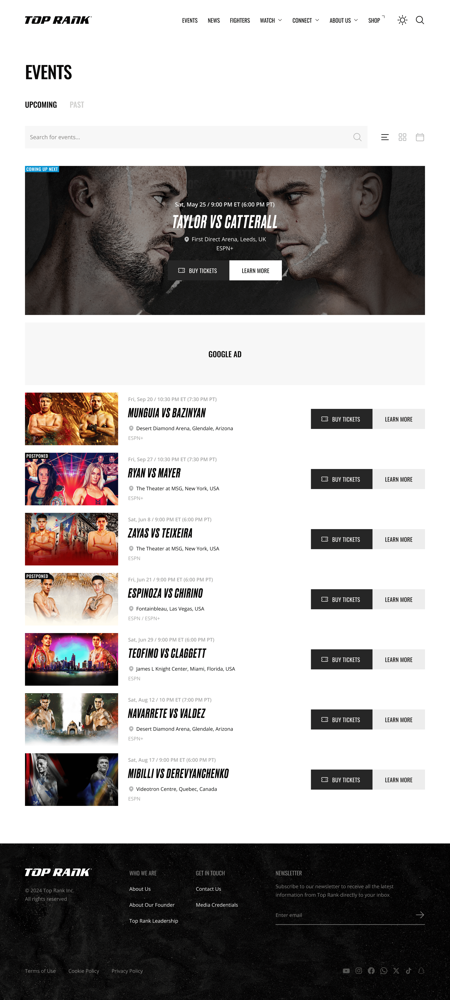
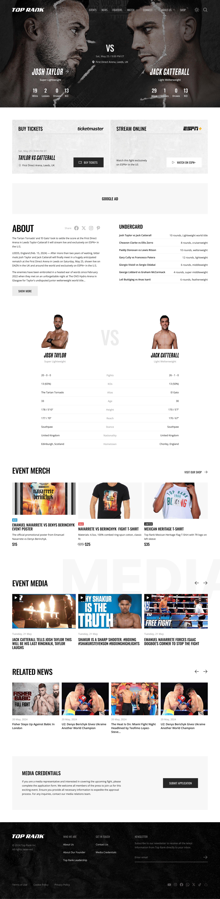
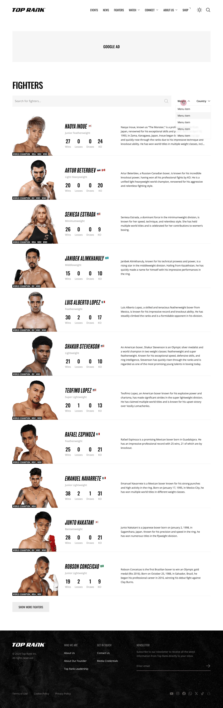
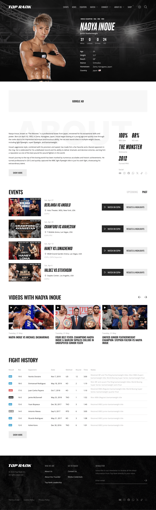
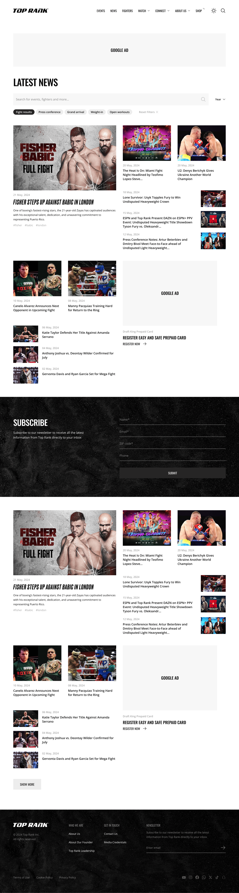
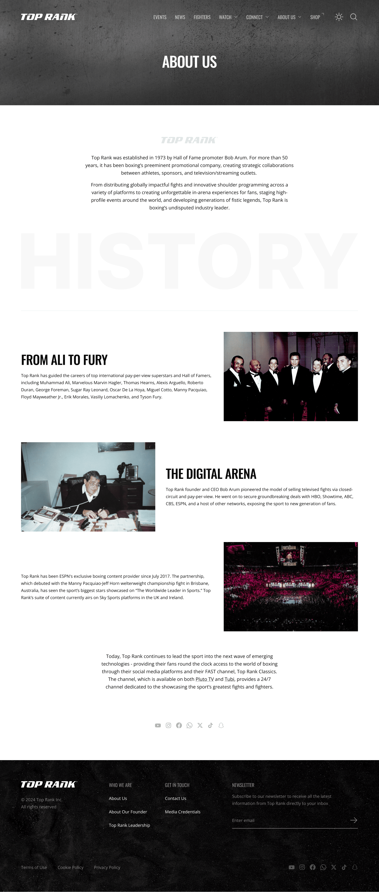
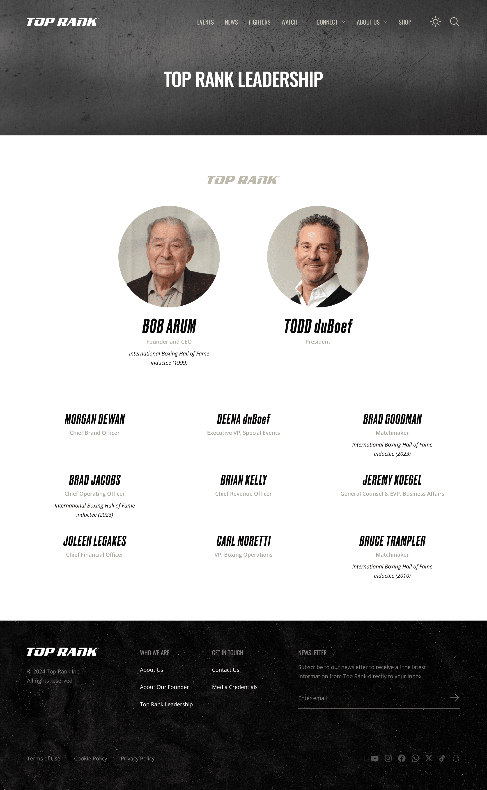
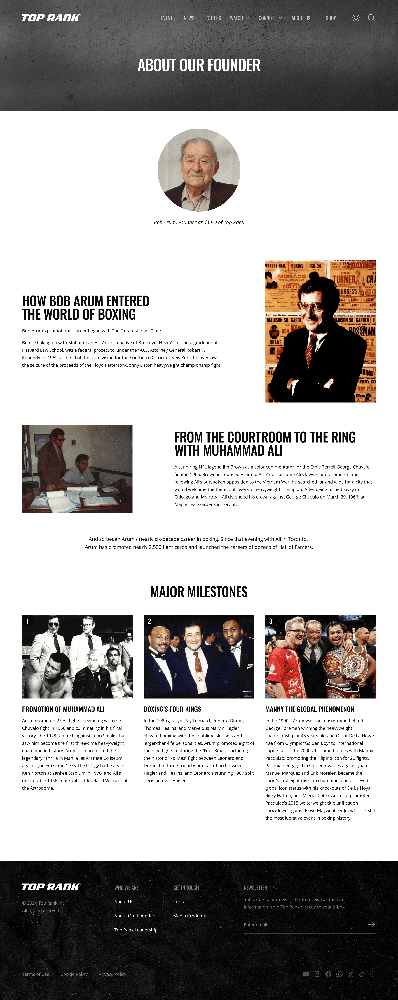

## Objective

Following the success of [Boxing Showtimes](/en/projects/boxing-showtimes/), the leading boxing promotion agency Top Rank reached out through the team at <a href="https://itprobe.us" target="_blank" rel="noopener">itprobe</a> (Seattle, USA) to request a complete redesign of their website and boxing merch e-commerce store.

## My contributions

- Developed a design system and UI kit
- Prepared Figma mockups with design tokens ready for integration with a React application
- Created reusable components in Figma
- Built all pages and screens, including mobile and tablet responsive versions
- Designed a theme for the Shopify merch store
- Implemented light and dark theme support
- Designed user flows for events, fighters and news sections

## Home page

The home page showcases key information about upcoming fights, top fighters and latest news. Light and dark theme support is implemented.

## Events

The Events section includes multiple views: an events list, a calendar, and a detailed event page with fighter information and bout schedules.

## Fighters

The Fighters section features a fighter catalog with weight class filtering and detailed profiles including stats, fight history and biography.

## News

The News section presents the latest boxing news with convenient navigation and category filtering.

## About

The About section includes information about the company, its history, leadership team and founder — the legendary Bob Arum.

## Results

- Completely redesigned website with a modern look
- Production-ready design system with tokens synced between Figma and code
- Reusable React-based components
- Light and dark theme support
- Responsive layout for desktop, tablet and mobile devices
- Custom Shopify theme
