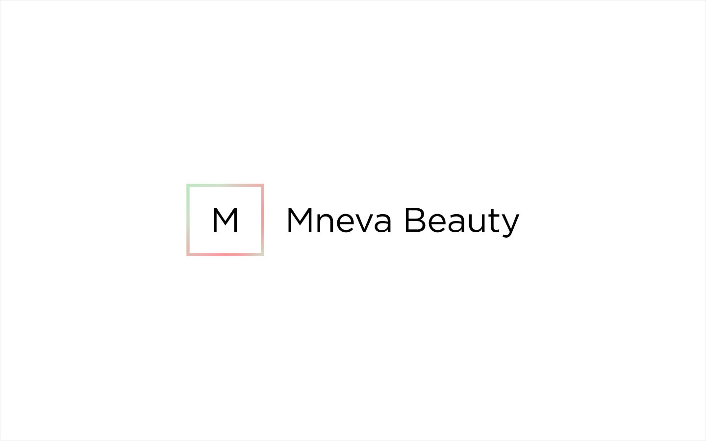
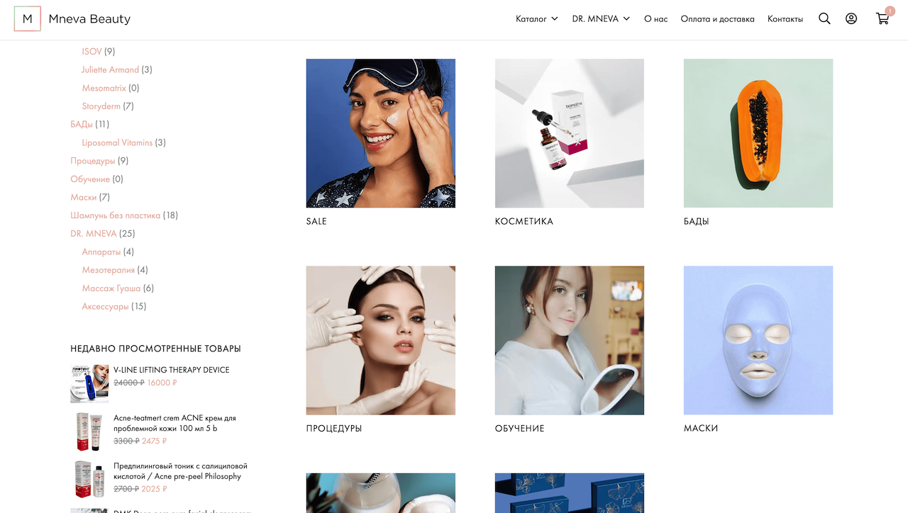

## About the project

For Mneva Beauty I created a distinctive brand identity and logo.

I focused on seamless integration of delivery and payment modules so every customer can place an order quickly. Adding an instalment payment option significantly increased conversions and made purchases more accessible.

To improve search visibility I carried out SEO optimisation. I also set up an advertising campaign in Yandex.Direct, which helped attract the right audience and boost site traffic.

